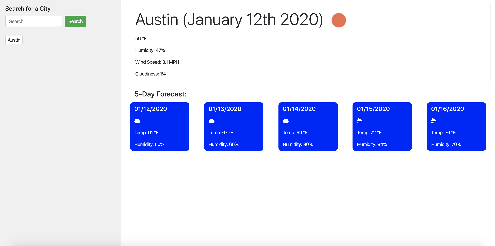

# Weather-Dashboard

Deployed: https://phoenix-99hp.github.io/Weather-Dashboard/

This is weather dashboard that allows the user to search for the weather information regarding a particular city. The current weather information is displayed in a jumbotron at the top of the website, and a 5-day forecast is generated just below the jumbotron. Weather information is retrieved from the openweathermap api (https://openweathermap.org/api). For each search the user makes of a particular city a button is generated (up to 10) just below the search bar so that the user can click the button and receive weather information from a past search. This website makes use of local storage in order to keep track of the user's past search history. 

